# WebFlux Playground

En esta sección (y para las siguientes) nuestro objetivo es configurar un proyecto de prácticas para aprender `Spring WebFlux`.

Aprenderemos varias características de `WebFlux`, `R2DBC` (Reactive Data Access) y escribiremos tests de integración.

Al final, configuraremos otro proyecto para desarrollar un sistema reactivo.

# Traditional vs Reactive APis

## Project Setup

Para crear el proyecto accederemos a `https://start.spring.io/` e indicaremos estos datos:

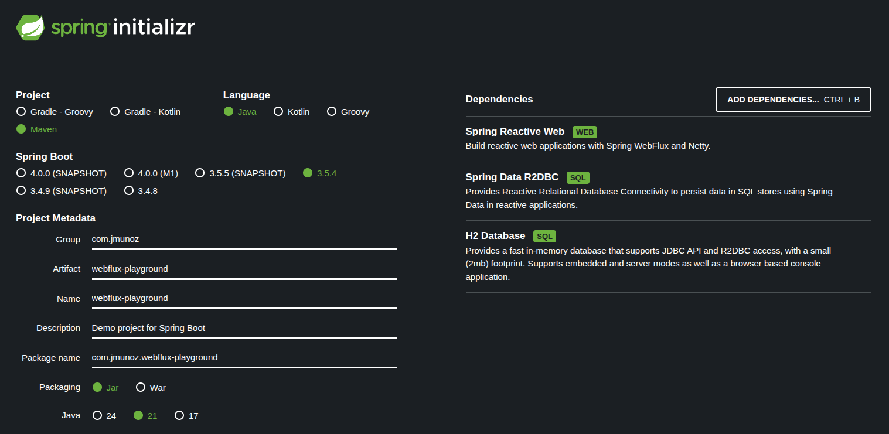

## Traditional vs Reactive API

Vamos a ver como una web reactiva es diferente de una web tradicional.

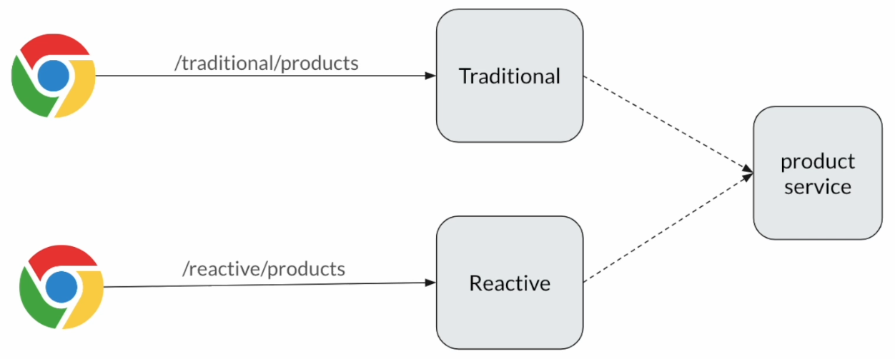

Vamos a desarrollar una aplicación muy sencilla, donde asumimos que hay un servicio externo de productos.

Como parte de una petición de entrada a nuestra app, haremos una llamada a este `product service` y, sea lo que sea que este servicio provea, devolveremos esa data a nuestro llamador.

Primero desarrollaremos la aplicación en un estilo de programación tradicional y luego haremos lo mismo en un estilo reactivo, para comprender algunas cosas importantes.

`product service` ya está desarrollado, y para ejecutarlo, solo tenemos que acceder a una terminal y ejecutar: `java -jar external-service.jar`.

Luego, acceder en el navegador al Swagger de este servicio: `http://localhost:7070/webjars/swagger-ui/index.html`.

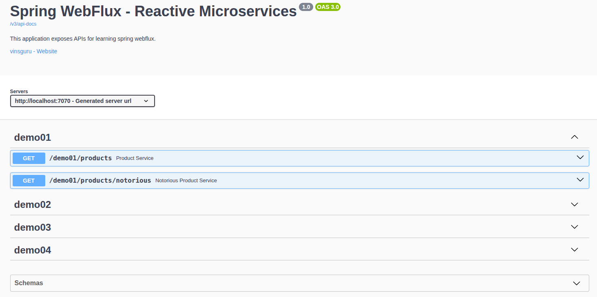

Trabajaremos en el endpoint `/demo01/products` donde, al invocarlo, tardará 10sg en obtener 10 productos, 1 por segundo.

Tratamos de simular un servicio remoto lento.

En `src/java/com/jmunoz/playground/sec01` creamos la clase:

- `Product`
  - Es un record.
- `TraditionalWebController`
  - Es un controller hecho en programación tradicional.
- `ReactiveWebController`
  - Es un controller hecho en programación reactiva.

**Testing**

- No olvidar ejecutar `external-services.jar`.

- Ejecutamos `WebFluxPlaygroundApplication`.
  - Traditional en un terminal con `curl`.
    - Usamos `curl` en una terminal para enviar una petición al endpoint hecho en programación tradicional: `curl -N http://localhost:8080/traditional/products`.
      - Vemos en los logs de ejecución de la app que nos lleva 10sg imprimir toda la información, es decir, los 10 productos.
      - En la terminal solo se ven los 10 productos cuando pasan los 10sg.
    - Volvemos a hacer la misma petición `curl`, pero ahora cancelamos la petición (Ctrl+C) tras unos segundos, porque el usuario no quiere esperar 10 sg.
      - Vemos en los logs de ejecución de la app que ha recuperado la lista de productos, aunque la habíamos cancelado.
      - En la terminal no se ve nada.
      - Vemos que en la terminal donde se ejecuta `external-services.jar` sigue esperando 10sg y completa la petición, es decir, aunque hemos cancelado la petición, un controlador tradicional sigue haciendo el trabajo.
  - Reactive en un terminal con `curl`.
    - Usamos `curl` en una terminal para enviar una petición al endpoint hecho en programación reactiva: `curl -N http://localhost:8080/reactive/products`.
      - Usamos la opción `curl -N` porque `curl` usa un buffering y hasta que no obtiene todo, no lo imprime en consola. Usando la opción `-N` no se usa este buffer y podremos ver en consola como se obtienen los productos de uno en uno. 
      - Vemos en los logs de ejecución de la app que cada segundo se recupera un producto.
    - Volvemos a hacer la misma petición `curl`, pero ahora cancelamos la petición (Ctrl+C) tras unos segundos, porque el usuario no quiere esperar 10 sg.
      - Vemos en los logs de ejecución de la app que cada segundo recuperó un producto y, cuando cancelamos, el controller paró inmediatamente.
      - En la terminal ya sabemos que va imprimiéndose cada producto cada segundo.
      - Vemos que en la terminal donde se ejecuta `external-services.jar` también se ha cancelado el trabajo, es decir, para el proceso.

- Ejecutamos `WebFluxPlaygroundApplication`.
  - Reactive en un navegador.
    - Accedemos al navegador usando la ruta `http://localhost:8080/reactive/products`.
      - En el navegador se usa un buffer, por lo que obtenemos de una vez todos los productos pasados 10sg.
      - En los logs de nuestra app obtenemos cada segundo un producto.
    - Accedemos al navegador usando la ruta `http://localhost:8080/reactive/products` y pulsando el botón `refresh` de vez en cuando.
      - Cada vez que pulsamos el botón `refresh`, si vemos los logs de `external-services.jar` veremos que se cancela la petición y vuelve a recibirse una nueva petición. 
  - Traditional en un navegador.
    - Accedemos al navegador usando la ruta `http://localhost:8080/traditional/products`.
      - En el navegador obtenemos los productos cuando pasan 10sg. Esto es independiente del buffering, porque obtenemos una lista.
      - En los logs de nuestra app tenemos que esperar los 10sg para obtener la lista.
    - Accedemos al navegador usando la ruta `http://localhost:8080/traditional/products` y pulsando el botón `refresh` de vez en cuando.
        - Cada vez que pulsamos el botón `refresh`, si vemos los logs de `external-services.jar` veremos que piensa que es una nueva petición, no sabe que se cancela la actual, se van acumulando las peticiones y tenemos que esperar 10sg a que se vayan completando. Hace mucho más trabajo.

## Exposing Streaming API

¿Cómo podemos enviar información del producto en forma de streaming al navegador?

Es decir, ejecutando el endpoint reactivo desde el terminal, conseguíamos ver cada producto conforme lo íbamos obteniendo, pero el navegador esto parece no entenderlo.

En realidad, es fácil.

En `src/java/com/jmunoz/playground/sec01` modificamos la clase:

- `ReactiveWebController`
  - Creamos un endpoint `products/stream` para conseguir ver en el navegador los productos de uno en uno.
  - Lo único que se añade es el `MediaType` `@GetMapping(value = "/products/stream", produces = MediaType.TEXT_EVENT_STREAM_VALUE)`

Por defecto, `MediaType` es `application/json`. Con esto, el navegador hace el buffering.

Pero si indicamos `MediaType.TEXT_EVENT_STREAM_VALUE` el navegador comprenderá que la respuesta viene en streaming.

**Testing**

- No olvidar ejecutar `external-services.jar`.

- Ejecutamos `WebFluxPlaygroundApplication`.
    - Reactive en un navegador.
        - Accedemos al navegador usando la ruta `http://localhost:8080/reactive/products/stream`.
            - Veremos aparecer en el navegador los productos de uno en uno, conforme llegan.

Más adelante, en otra sección, hablaremos más sobre esto.

## Common Mistake Using Reactive Pipeline

Este es un error típico en el que los desarrolladores creen que están haciendo programación reactiva, cuando no lo es.

En `src/java/com/jmunoz/playground/sec01` modificamos la clase:

- `TraditionalWebController`
  - Creamos un endpoint `products2` que devuelve un `Flux`, pero que no es programación reactiva, sino código síncrono bloqueante.

**Testing**

- No olvidar ejecutar `external-services.jar`.

- Ejecutamos `WebFluxPlaygroundApplication`.
  - Traditional en un terminal con `curl`.
    - Usamos `curl` en una terminal para enviar una petición al endpoint hecho en programación tradicional: `curl -N http://localhost:8080/traditional/products2`.
      - Vemos que obtenemos los 10 productos solo cuando pasan 10sg, no de uno en uno, tanto en la terminal como en los logs de nuestra app. 
      - Aunque cancelemos antes de que pasen 10sg, el servicio externo sigue haciendo el trabajo y en los logs de nuestra app, pasados esos 10sg, seguimos viendo la respuesta con los 10 productos.

## How Reactive Web Works - Step By Step

Vamos a ver como funcionan las webs reactivas.

**Reactive**

Ya sabemos que la programación reactiva está basada en el patrón Publisher/Subscriber.

Al igual que visualizamos todo como objetos en la POO, en la programación reactiva o cuando desarrollamos microservicios reactivos, tenemos que visualizar todo como un publisher o un subscriber.

Por ejemplo, si tenemos un backend y un navegador, el backend actúa como publisher y el navegador como un subscriber.

Una de las preguntas típicas es, ¿cómo sabe mi navegador (o Postman) como subscribirse a un publisher?

Lo que ocurre es que, cuando envían una petición, se establece una conexión. Esto es subscribirse a un publisher.

Para comprender mejor esto, mirar esta imagen:

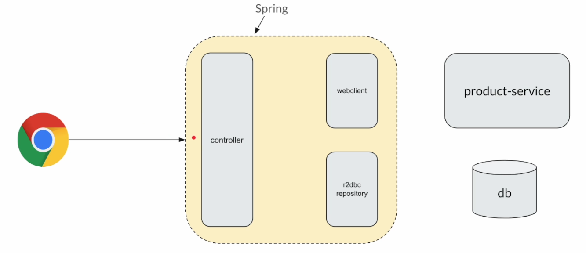

Es un ejemplo de una app hecha con Spring WebFlux. Estamos exponiendo nuestras APIs via un controller. Este controller devuelve un publisher tipo `Flux<Product>`, y la data la obtenemos de un servicio remoto `product-service` vía uso de `WebClient`.

Este `WebClient` es sencillamente un envoltorio alrededor de `Reactor Netty` (ver `https://github.com/JoseManuelMunozManzano/Mastering-Java-Reactive-Programming/tree/main`).

Este `WebClient` puede enviar la petición y recibir la respuesta de manera no bloqueante.

Igualmente, si tenemos que hacer llamadas a BD, usaremos `R2DBC` (lo veremos en la próxima sección).

Cuando exponemos las APIs desde el controller, no las exponemos directamente para el navegador, sencillamente devolvemos un tipo publisher como Mono o Flux.

Hay una capa exterior, que es Spring Framework, no la olvidemos.

Cuando el navegador envia una petición a nuestra aplicación, no va directamente al controller, sino que hay un `three way handshake` entre el navegador y Spring para establecer una conexión TCP.

Una vez se ha hecho el `handshake` el navegador manda realmente la petición de los productos y Spring acepta la petición y enruta la petición al controller.

Entonces, Spring verá que el tipo de retorno es un tipo publisher, así que se subscribirá a este publisher.

Así que el navegador se está subscribiendo al Flux, pero no directamente, sino que es el Framework de Spring es el que subscribirá al Flux.

Ya sabemos que hasta que alguien no se subscribe, el publisher por sí solo no ejecuta nada, en el controller solo se construye el pipeline reactivo. Es decir, no enviamos la petición HTTP en este momento.

La petición solo se envía cuando Spring se subscribe a este Flux, y solo entonces `WebClient` mandará la petición a `product-service`.

`WebClient` recibirá la data de manera no bloqueante.

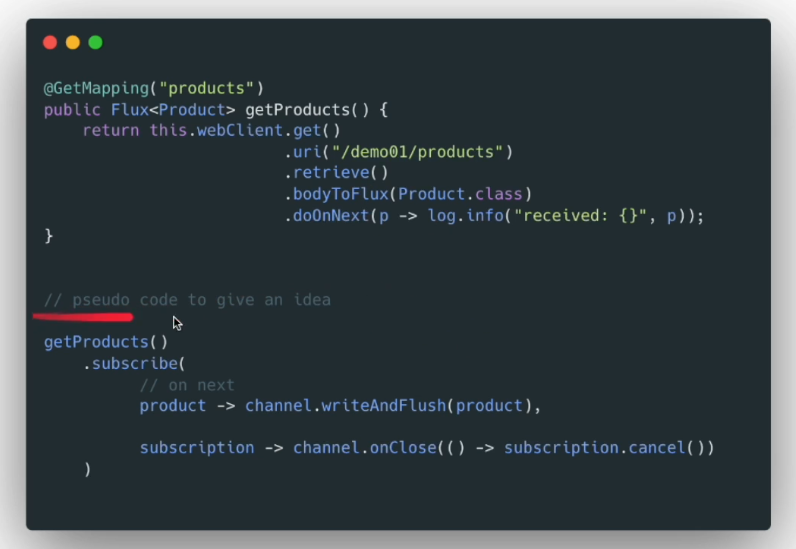

La primera parte del código la invoca Spring y la segunda parte es un pseudocódigo que muestra como se subscribe y obtenemos el producto.

Una vez lo obtenemos, Spring tomará la información del producto y la escribirá vía la conexión (flush) en el navegador.

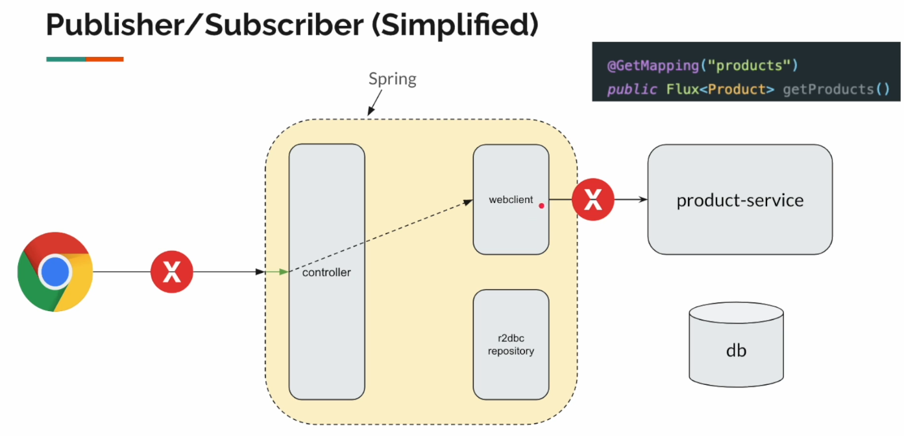

Igualmente, cuando el cliente cancela la petición o cierra el navegador, podemos detectarlo.

En la imagen donde vemos el pseudocódigo, se ve un callback `channel.onClose()`, que se invocará cuando la conexión o el canal se cierre.

Cuando nos subscribimos a `getProducts()` obtenemos el objeto `subscription`, por tanto, en `channel.onClose()` indicamos que cancelamos nuestra subscripción.

Esa subscripción viene del `WebClient`, es decir, si cancelamos, estamos diciendo al `WebClient` que pare de hacer el trabajo, así que el `WebClient` cerrará su canal con `product-service` y este lo detecta y para de hacer el trabajo.

Indicar que ChatGPT trabaja más o menos de forma similar, con streams.

**Traditional**

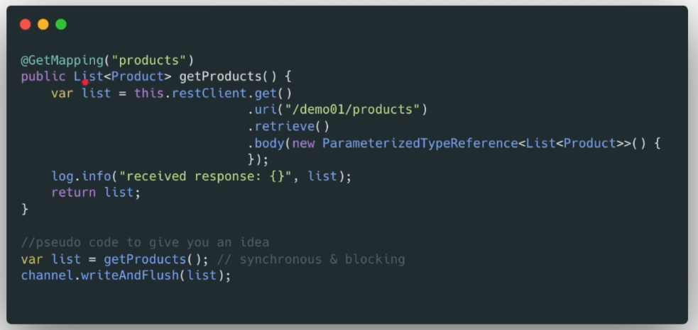

Cuando en la manera tradicional de programar devolvemos una lista, Spring invocará el método `getProducts()`.

Como es una lista, es un código de estilo síncrono y bloqueante, así que tenemos que esperar a que `product-service` devuelva a `RestClient` la lista completa.

Solo entonces (cuando pasan los 10sg) podemos escribirla en el canal (flush) y dársela al navegador.

## Should Entire Stack Be Reactive?

Otra pregunta muy común es, cuando usamos reactive, ¿debería ser toda la pila reactiva?

Sería genial si toda la pila fuera reactiva porque obtendríamos todo el potencial del streaming, con `backpressure`...

Sin embargo, cuando tenemos varias aplicaciones como parte de una arquitectura, no es posible migrarlo todo a Spring WebFlux desde el primer día.

Imaginemos que dadas dos aplicaciones, una está migrada y la otra no. No ocurre nada malo con esto.

Está claro que la primera app usará el sistema de recursos más eficientemente, y la segunda app seguirá funcionando como antes.

Cuando tengamos tiempo, migraremos la segunda app a Spring WebFlux para obtener todo su potencial.

## Reactive Web is Resilient - Demo

Volvemos al Swagger de nuestro recurso externo `external-services.jar`.

Trabajaremos en el endpoint `/demo01/products/notorious`. Su funcionamiento es como el anterior, es decir, tratará de darnos 10 productos, donde cada uno tardará un sg. Sin embargo, este servicio fallará mientras procesa la petición.

Lo que intentamos conseguir es, cuando recibimos una petición, usando nuestro `WebClient` enviaremos una petición a `external-services`, que fallará, y veremos qué ocurre.

En `src/java/com/jmunoz/playground/sec01` modificamos la clase:

- `TraditionalWebController`
  - Creamos un endpoint `products3` para llamar a este endpoint y ver que ocurre cuando falla.
- `ReactiveWebController`
  - Creamos un endpoint `products3` para llamar a este endpoint y ver que ocurre cuando falla.

**Testing**

- No olvidar ejecutar `external-services.jar`.

- Ejecutamos `WebFluxPlaygroundApplication`.
  - Traditional en un terminal con `curl`.
    - Usamos `curl` en una terminal para enviar una petición al endpoint hecho en programación tradicional: `curl -N http://localhost:8080/traditional/products3`.
      - Vemos en la terminal de nuestra app que falla la JVM al pasar 4sg y obtenemos un error 500.
      - El servicio externo falla y termina el programa.
  - Reactive en un terminal con `curl`.
    - Usamos `curl` en una terminal para enviar una petición al endpoint hecho en programación tradicional: `curl -N http://localhost:8080/reactive/products3`.
      - Vemos en la terminal de nuestra app que obtenemos 4 productos (respuesta parcial) y luego falla la JVM y obtenemos un error con código 18. 
      - El servicio externo falla y termina el programa.
  
Indicar que la respuesta parcial no puede deserializarse porque comienza con un corchete abierto, pero luego no acaba en un corchete cerrado.

Entonces, ¿para qué? El punto aquí es que es muy fácil de manejar el error usando `onErrorComplete()` para cambiar una señal de error a una de complete.

Con esto, vemos que obtenemos los 4 productos, pero ya no hay error en nuestra app y se cierra el corchete, por lo que ya podemos deserializar el código obtenido, aunque sea parcial. Indicar que `external-services.java` si falla y el programa se termina, pero el nuestro no.

Es decir, nuestra aplicación es más resiliente a errores gracias a operadores como `onErrorComplete()`. Pero si queremos que falle, también podemos hacerlo y lo veremos más adelante.

Sin embargo, en un controller web tradicional no se puede hacer esto. U obtenemos toda la lista o nada, no hay opción de obtener una respuesta con una lista parcial.

## Summary

- Reactive vs Traditional API
- Responsive
  - Reacting quickly
  - Streaming response
  - Cancel

# Spring Data R2DBC

`R2DBC` significa `Reactive Relational Database Connectivity`.

Documentación: 

- `https://r2dbc.io/spec/1.0.0.RELEASE/spec/html/`.
- `https://r2dbc.io/drivers/`.
- `https://r2dbc.io/spec/1.0.0.RELEASE/spec/html/#datatypes`.
- `https://docs.spring.io/spring-data/relational/reference/r2dbc.html`.
- `https://docs.spring.io/spring-data/relational/reference/r2dbc/query-methods.html`.
- `https://medium.com/@padiahrohit/enable-h2-console-in-java-reactive-environmant-dcfcfdd6858a`

## Introduction

Qué es `R2DBC`.

- JPA es una especificación.
  - Se usa en programación tradicional síncrona.
- R2DBC es una especificación separada.
  - Se usa en programación reactiva.
- R2DBC no es exactamente lo mismo que JPA.

Características de `R2DBC`:

- Prioriza
  - Rendimiento
  - Escalabilidad
  - Streaming + Backpressure (se hará una demo con un driver Postgres)
- No tiene características tipo Hibernate como
  - @OneToMany
  - @ManyToMany
  - ...

R2DBC soporta mapeo de objetos de entidad simple.

Para ver documentación de los drivers que soporta actualmente R2DBC ver: `https://r2dbc.io/drivers/`.

En este curso usaremos la BD H2 por motivos de aprendizaje y se hará una demo con un driver Postgres más tarde.

Tenemos `Spring Data R2DBC`, que es un envoltorio alrededor de `R2DBC`.

Aunque ya se ha dicho que no es lo mismo `R2DBC` que `JPA`, si se ha usado `Spring Data JPA`, al usar este nuevo `Spring Data R2DBC` no notaremos ninguna diferencia. Su uso simplifica todo mucho. 

Crearemos una interface y proveeremos `Query Methods` como estos.

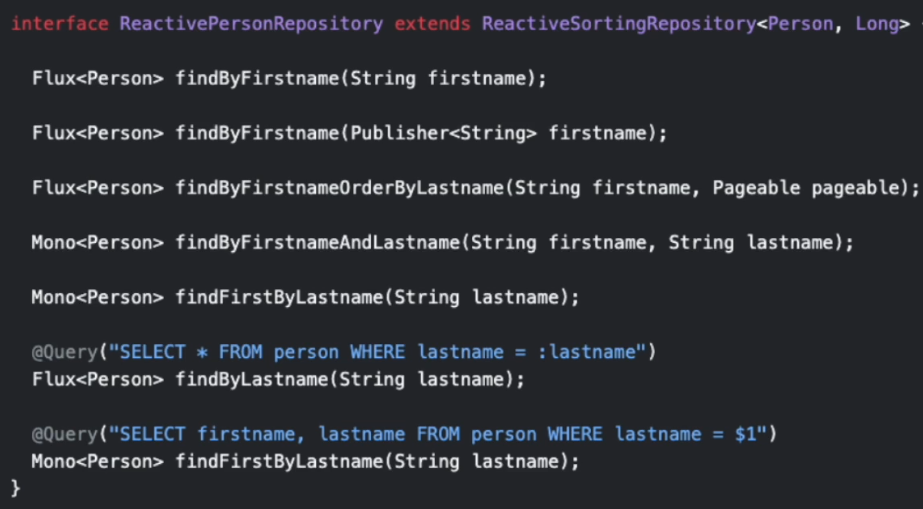

Spring hará toda la magia y automáticamente creará los SQL`s. Lo importante es que indicaremos el tipo de retorno publisher (Mono o Flux).

## Connection String

Estas con cadenas de conexión para las BD H2, Postgres y MySql:

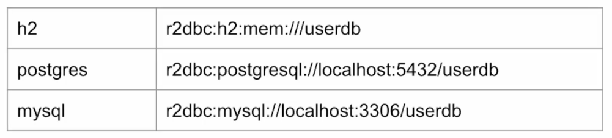

Indicamos esta tabla como documentación, pero no hace falta indicarlo porque Spring lo hace automáticamente por nosotros.

Estas son las propiedades de configuración que tenemos que indicar en el fichero `application.properties` para poder conectarnos a Postgres.

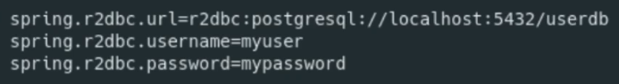

**Recursos para R2DBC**

Scripts de Inicialización de BD

- For db initialization scripts
  - `spring.sql.init.data-locations=classpath:sql/data.sql`
- To show SQL
  - `logging.level.org.springframework.r2dbc=TRACE`

## Project Setup

Estas son las tablas (y sus relaciones) del proyecto que se va a realizar en esta sección:

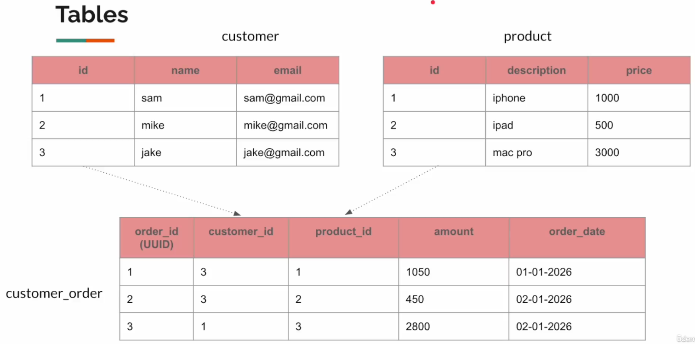

En `src/main/resources/sql` esta el código `data.sql` con los SQL`s necesarios para que Spring pueda crear estas tablas.

Nuestro proyecto lo vamos a hacer en `src/java/com/jmunoz/playground/sec02` pero vamos a tener un problema. 

Cuando Spring se ejecute, va a intentar escanear todos los paquetes y crear los beans. Esto puede causar algún conflicto, como que exista la misma clase de ProductRepository, por ejemplo, en distintos paquetes.

Para evitar esto, vamos a usar la propiedad `scanBasePackages` en `WebfluxPlaygroundApplication.java` para que Spring no escanee todos los paquetes, solo los que le digamos.

Por tanto, creamos/modificamos las clases siguientes:

- `WebfluxPlaygroundApplication.java`
  - El main, donde indicaremos que paquete tiene que escanear Spring para crear sus beans.
- `application.properties`
  - Indicamos la configuración de la BD para R2DBC.

## Customer Entity / Repository

Creamos la clase entity y la interfaz repository para la tabla `customer`.

En `src/java/com/jmunoz/playground/sec02` creamos las clases:

- `Customer`
  - Es la clase entity que representa a la tabla `customer`.
  - En el package entity.
- `CustomerRepository`
  - Es la interfaz repository que usaremos para tener ya creado un CRUD.
  - Extiende de `ReactiveCrudRepository`.
  - En el package repository.

En `src/test/java/com/jmunoz/playground.tests.sec02` creamos la clase:
- `AbstractTest`
  - Es una clase abstracta que extenderemos para hacer tests.

## StepVerifier - Crash Course

Vamos a jugar con R2DBC query methods y a escribir tests durante las siguientes clases.

Es un prerequisito tener nociones de StepVerifier y estos métodos para poder escribir tests:

- StepVerifier.create(...)
- Next
  - expectNext(...)
  - expectNextCount()
  - thenConsumeWhile(...)
  - assertNext(...)
- Complete/Error
  - expectComplete()
  - expectError()
- Verify (¡No olvidarlo! Es quien se subscribe y ejecuta el test)
  - verity()

## CRUD Using Repository

En `src/test/java/com/jmunoz/playground.tests.sec02` creamos la clase:

- `Lec01CustomerRepositoryTest`
  - Es un test sobre la interface CustomerRepository.

Sobre la mutación de objetos (test sobre update) tener en cuenta:

- La programación reactiva es una programación de estilo funcional particularmente para aplicaciones con IO intensivas.
- La programación funcional prefiere funciones puras (sin efectos secundarios)
  - Preferir funciones puras donde sea posible, pero no ciegamente en todas partes.
- ¡Nuestra tabla de BD es mutable! ¡Nuestro objeto entidad es mutable!
  - ¡Mutar está bien!

Para mutar un registro, tenemos que hacerlo via el pipeline reactivo, y usaremos el operador `doOnNext(...)`.

Ejemplo: 

```java
// IO no bloqueante.
// Con doOnNext() podemos mutar objetos.
// Los operadores, para un item, no se invocan concurrentemente. ¡Es secuencial!
this.repository.findById(1)
        .doOnNext(c -> c.setName("sam"));

// Esto es equivalente al estilo tradicional
var customer = getCustomer(1);
customer.setName("sam");
```

## R2DBC - Show SQL

Para poder ver las sentencias SQL que se están ejecutando (siempre para propósitos de debug) tenemos que indicar una propiedad.

Se puede hacer en `application.properties` pero en este caso lo vamos a hacer en la clase `AbstractTest` (aunque la dejamos comentada).

Esta propiedad es realmente a nivel de logger, y es la siguiente:

`logging.level.org.springframework.r2dbc=DEBUG`

## Product Entity / Repository

Creamos la clase entity y la interfaz repository para la tabla `product`.

En `src/java/com/jmunoz/playground/sec02` creamos las clases:

- `Product`
    - Es la clase entity que representa a la tabla `product`.
    - En el package entity.
- `ProductRepository`
    - Es la interfaz repository que usaremos para tener ya creado un CRUD.
    - Extiende de `ReactiveCrudRepository`.
    - En el package repository.

En `src/test/java/com/jmunoz/playground.tests.sec02` creamos la clase:

- `Lec02ProductRepositoryTest`
    - Es un test sobre la interface ProductRepository.

## Pageable

Spring Data R2DBC soporta resultados paginados.

Se usa la interface `Pageable` para hacer peticiones de chunks de data cuando tenemos set de datos muy grandes. Por ejemplo:

- Page 1, Size 10
- Ordenar por Price ascendente

Añadimos la paginación en `ProductRepository` y le hacemos tests en `Lec02ProductRepositoryTest`.

## Complex Queries / Join

Para consultas complejas o joins, es preferible usar SQL, ya que es eficiente y evitamos el problema N+1 (referencias circulares).

Además, R2DBC no tiene anotaciones para `@ManyToMany`... ya que intenta ser muy sencillo y centrarse en rendimiento y escalabilidad.

Es por ello que R2DBC prefiere sentencias SQL para consultas complejas, porque son más eficientes.

Las sentencias SQL pueden ejecutarse de dos formas distintas:

- Usar el Repository.
  - Usamos la anotación `@Query` y la sentencia SQL.
- Database client.

Vamos a ver un ejemplo de cada posibilidad.

## Join Query Using @Query

En `src/java/com/jmunoz/playground/sec02` creamos las clases:

- `CustomerOrder`
    - Es la clase entity que representa a la tabla `customer_order`.
    - En el package entity.
- `CustomerOrderRepository`
    - Es la interfaz repository que usaremos para tener ya creado un CRUD.
    - Extiende de `ReactiveCrudRepository`.
    - En el package repository.

En `src/test/java/com/jmunoz/playground.tests.sec02` creamos la clase:

- `Lec03CustomerOrderRepositoryTest`
    - Es un test sobre la interface CustomerOrderRepository.

## Projection

Vamos a obtener distintos campos de las distintas tablas de las que consta nuestro proyecto. A esto se le llama `projection`.

Podemos crear una clave Java (records) que represente la fila que queremos obtener.

En `src/java/com/jmunoz/playground/sec02` creamos la clase:

- `OrderDetails`
    - Record con la representación de la fila que queremos obtener en la query. 
    - En el package dto.

Añadimos un nuevo método a `CustomerOrderRepository` y lo probamos en `Lec03CustomerOrderRepositoryTest`.

## R2DBC Database Client

Usando DatabaseClient podemos ejecutar cualquier SQL sin necesidad de tener un repository.

En `src/test/java/com/jmunoz/playground.tests.sec02` creamos la clase:

- `Lec04DatabaseClientTest`
    - Es un test para probar SQLs complejos usando DatabaseClient.

## Testing

Para probar los tests, solo tenemos que ir a cada una de las clases de test y ejecutarlos.