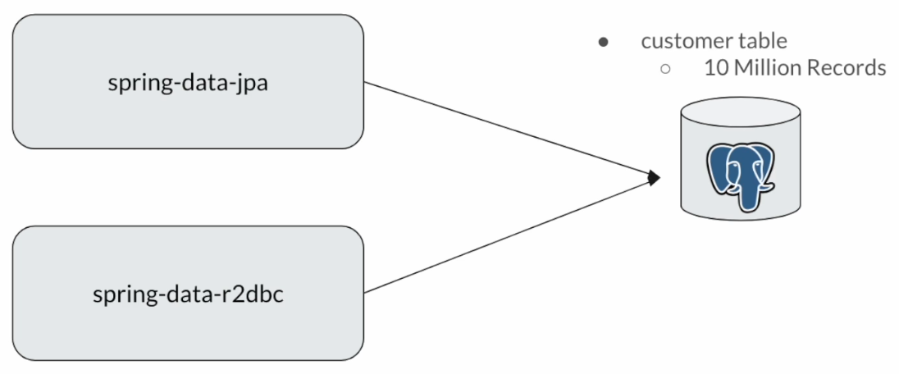
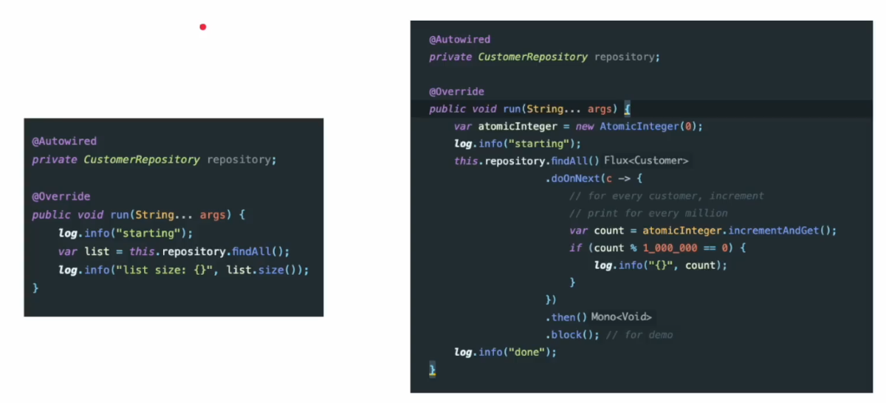
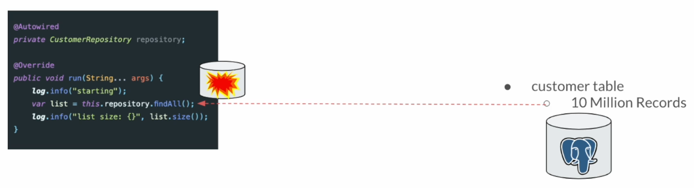
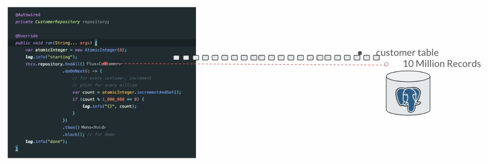
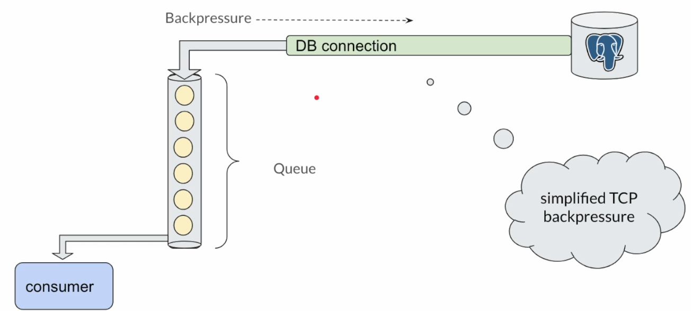
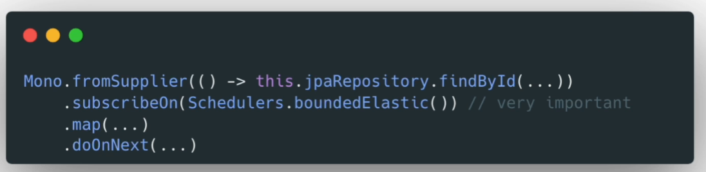
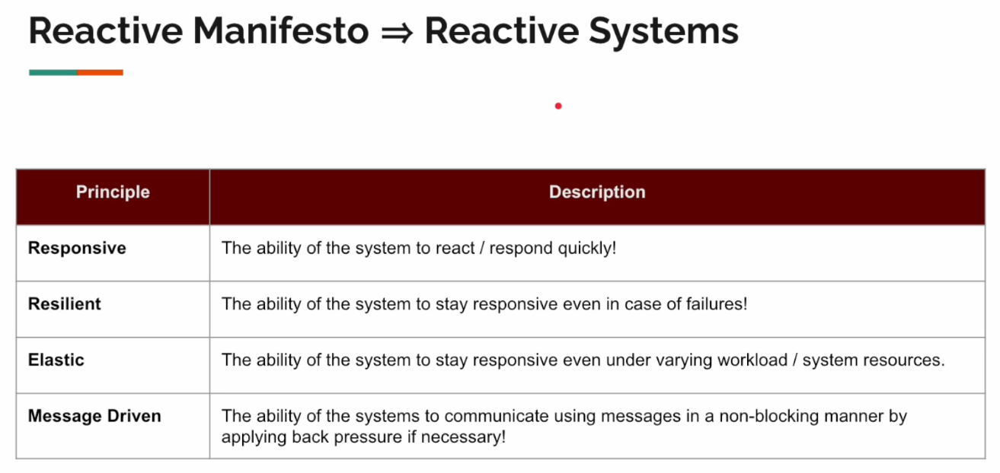

# R2DBC vs JPA/JDBC

Es una comparación entre reactivo y tradicional.

En concreto, se van a comparar las siguientes características del módulo Spring Data R2DBC contra el módulo Spring Data JPA:

- Eficiencia de recursos
    - Cuantos recursos de sistema usan.
- Rendimiento
    - Número de tareas ejecutadas por unidad de tiempo.

**Notas**

- No traeremos otras aplicaciones / capas web en el test, porque el resultado no sería preciso.
- No usaremos queries de larga ejecución.
    - Queremos testear r2dbc vs jdbc/jpa.
    - No el motor de BD.
    - Esas queries de larga ejecución serían buenas para comparar postgres contra mysql, cosa que no queremos.

**Configuración**

Esta es la configuración del proyecto:

- Ejecutar `docker-compose up`.
- Monitorizar la consola. Asegurar que tenemos 10 millones de customers insertados.
    - Esperar al mensaje `database system is ready to accept connections`.
- Ver el fichero `Makefile`.
  - Ejecutar en la terminal `make package` para crear el fichero jar tanto para el módulo reactivo como el tradicional.
  - Ejecutar en la terminal `make reactive-throughput-test`
    - Se lanzan 100.000 queries de una en una y se hacen 10 tests.
    - Veo que tarda 1.35 sg de media y hace unas 74000 queries por segundo de media.
  - Ejecutar en la terminal `make traditional-throughput-test` indicando en el fichero `Makefile` la property `--useVirtualThreadExecutor=false`
    - Se lanzan 100.000 queries de una en una y se hacen 10 tests.
    - Veo que tarda 1.9 sg de media y hace unas 52000 queries por segundo de media.
  - Ejecutar en la terminal `make traditional-throughput-test` indicando en el fichero `Makefile` la property `--useVirtualThreadExecutor=true`
    - Se lanzan 100.000 queries de una en una y se hacen 10 tests.
    - Veo que tarda 2.3 sg de media y hace unas 43000 queries por segundo de media.
  - Ejecutar en la terminal `make traditional-efficiency-test` indicando en el fichero `Makefile` `-Xmx4000m` (cambiar a -Xmx6000m para que no dé el error)
    - Se ejecuta un findAll (solo una query) para traer todos los registros de una vez.
    - Veo que tarda unos 11 sg con `-Xmx6000m`
    - Me da un error `java.lang.OutOfMemoryError: Java heap space` con `-Xmx4000m`
  - Ejecutar en la terminal `make reactive-efficiency-test` indicando en el fichero `Makefile` `-Xmx6000m` (cambiar a -Xmx4000m y luego a -Xmx200m)
    - Se ejecuta un findAll (solo una query) para traer todos los registros, pero en la terminal aparecen de 1 en 1 millón (vamos viendo resultados!!).
    - Veo que tarda 12.5 sg para `-Xmx6000m`
    - Veo que tarda 12.5 sg para `-Xmx4000m`
    - Veo que tarda 12 sg para `-Xmx200m`

Con respecto al rendimiento (throughput) vemos que R2DBC usa un menor número de conexiones a la BD comparado con JDBC.

Con respecto a la eficiencia, lo importante es ver que incluso reservando solo 200Mb de RAM obtenemos la data usando el módulo reactivo, mientras que usando programación tradicional con 4GB ya da error de heap.

## Virtual Treads did not impact the throughput

Esta sección trataba sobre JDBC vs. R2DBC.

Para ver las ventajas de los hilos virtuales, debería comparar:

JDBC + hilos de plataforma
vs.
JDBC + hilos virtuales

Esta comparación nos mostraría cómo los hilos virtuales permiten muchas más llamadas JDBC concurrentes con un menor consumo de recursos.

Aunque JDBC es bloqueante, los hilos virtuales lo hacen más económico.

No incluí esa comparación específica en esta sección porque se centraba en JDBC vs. R2DBC y sabemos que los hilos virtuales son mejores para la I/O en el estilo de programación tradicional.

Se puede cambiar ExecutorService y probar, si necesitamos la comparación de hilos de plataforma (platform thread).

Pero incluso con hilos virtuales, el controlador JDBC subyacente sigue siendo síncrono y utiliza E/S bloqueante.

Si bien los hilos virtuales reducen la sobrecarga de gestión de hilos, la base de datos sigue gestionando una consulta por conexión.

Es posible que necesite más conexiones JDBC para soportar la concurrencia. Se puede ajustar fácilmente el tamaño del pool mediante propiedades si deseamos probarlo también.

"¿Se debe al controlador JDBC subyacente?" - Exactamente. Esa fue la comparación de la sección.

R2DBC se diseñó desde cero para ser totalmente reactivo y utiliza funciones del protocolo de base de datos, como la segmentación, de forma más eficiente.

Puede gestionar más consultas concurrentes con menos conexiones (gracias a la multiplexación de conexiones). Puedes usar comandos como netstat para ver la cantidad de conexiones utilizadas. (En la sección 12, se muestra el comando netstat para demostrar HTTP2 y hablar sobre la multiplexación).

Luego, un usuario comenta:

Tras investigar más a fondo, descubrí que las conexiones y controladores JDBC aún no son totalmente compatibles con los hilos virtuales.

Si bien los hilos virtuales pueden aparcarse dentro de la JVM en lugar de bloquear un hilo portador subyacente, el propio controlador JDBC termina bloqueando dicho hilo.

Además, el sistema de gestión de bases de datos solo permite un número limitado de conexiones simultáneas.

Tras aumentar el tamaño del grupo a 300, cambiar el grupo de hilos a un grupo fijo de 256 y aplicar un semáforo a la tarea principal, observé que los hilos virtuales empezaron a tener un mejor rendimiento que los hilos de la plataforma y R2DBC.

## How R2DBC Works

En esta imagen vemos el código ejecutado para eficiencia en tradicional y reactivo.

Hemos visto que el código tradicional necesita más de 4GB de RAM para que no falle mientras que el enfoque reactivo ha funcionado con apenas 200MB de RAM (con 100MB también funciona).

**¿Qué pasa aquí?**

Cuando indicamos `findAll()` obtenemos todos los registros como una lista y falla si no tenemos suficiente memoria.

Mientras, en la programación reactiva, para comprender por qué funciona, necesitamos entender el concepto `backpressure` visto en el curso previo.

`Flux` no es una estructura de datos ni una lista. Es un `pipe` por el que fluye la data. Es decir, no mantiene nada como una lista.

El driver reactivo obtiene la misma petición de obtener todos los registros, la BD da el resultado y envía la información como parte de la conexión a la BD y la data va como flujo de bytes (streams).

En programación tradicional, la data también va como un flujo de bytes, pero el problema es que colecciona todo e intenta construir una lista.

Mientras, el enfoque reactivo, cuando recibe la data, decodifica el mensaje y lo da como un Customer Entity para realizar el procesamiento. Basado en la velocidad de procesamiento, recoge la data y decodifica el mensaje. 

`Flux` tiene una cola interna e intentará mantener 256 items. El número no es importante, solo tenemos que recordar que intentará mantener una cantidad muy pequeña de items.

Nuestro `consumer` drenará los items de la cola y se procesarán.

Todo ocurre internamente dentro del `Flux`.

Imaginemos que nuestro `consumer` es muy lento, por tanto, la velocidad de procesamiento es muy lenta. Eso lleva a que la cola se llene fácilmente.

La conexión de BD es una conexión TCP y como parte del reconocimiento de paquetes TCP habrá un mensaje enviado a la BD que diga que el consumer es muy lento y que el buffer receptor ya está lleno.

Las BD entienden esto y reaccionan dejando de enviar data. A esto se le llama `TCP backpressure`.

Por tanto, la bases de datos y el driver reactivo usan esta técnica para obtener registros de manera más eficiente, sin desperdiciar recursos del sistema.

En concreto, el enfoque reactivo solo necesita memoria RAM suficiente para guardar esos 256 items en memoria, mientras que el enfoque tradicional necesita memoria suficiente para contener todos los items.

## FAQ - Can I use Spring Data JPA?

Antes de usar R2DBC en nuestra aplicación, tener en cuenta que:

- ¡R2DBC es nuevo! Postgres V1.0.0 fue lanzada a finales de 2022 (algunas características todavía no están implementadas)
- El rendimiento debe ser medido. No puede adivinarse y depende de la aplicación/implementación.
  - Toma escenarios de uso frecuente / alto rendimiento de tu aplicación.
  - Haz tests de rendimiento para tu aplicación usando R2DBC.
  - Monitoriza usando herramientas como new relic, jconsole, pgadmin, comando netstat para conexión de redes...

Si R2DBC, al ejecutar los tests, no tiene un buen rendimiento, ¿qué opciones tenemos?

Con Spring WebFlux podemos seguir usando Spring Data JPA sin problemas, pero tenemos que usar el Scheduler `boundedElastic()`:

Usando ese Scheduler, no bloquearemos el hilo del bucle de eventos (event loop thread).

## Reactive Manifesto

El Manifiesto Reactivo promueve el diseño de sistemas que son altamente responsivos, resilientes, elásticos y conducidos por mensajes.

Estos 4 principios están relacionados los unos con los otros.