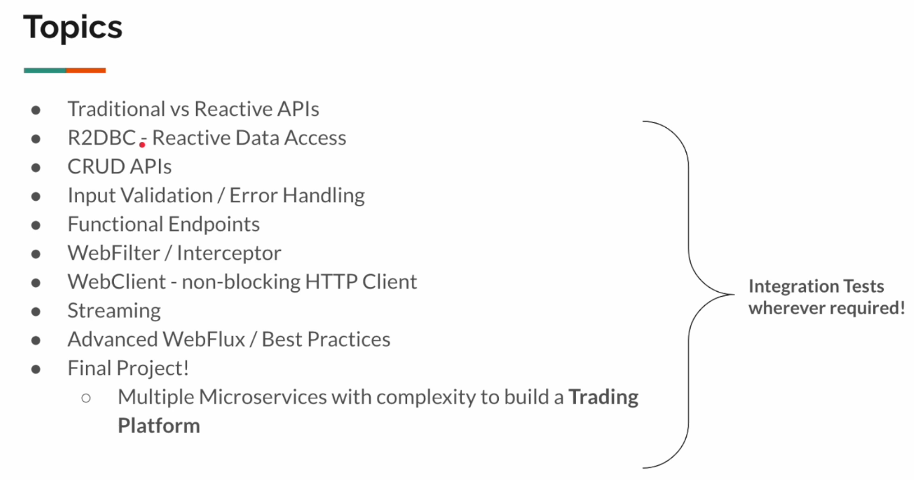
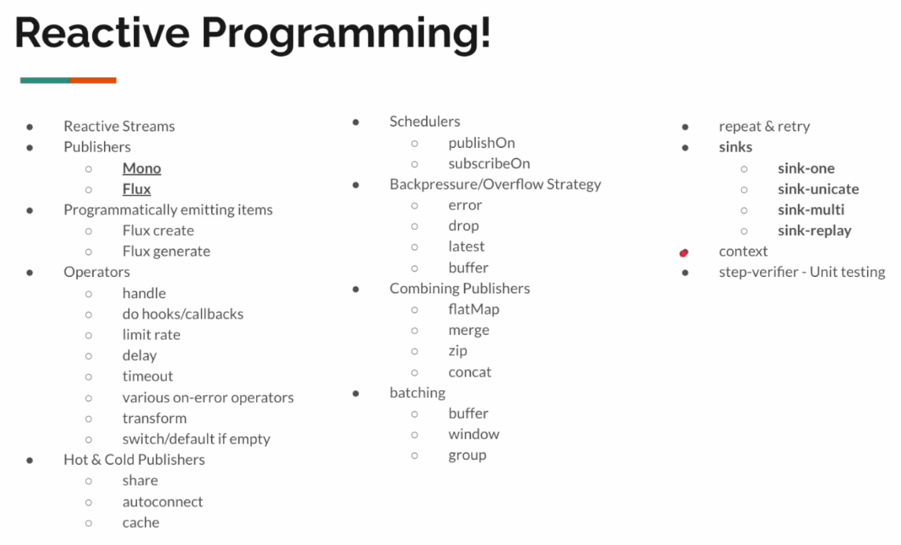
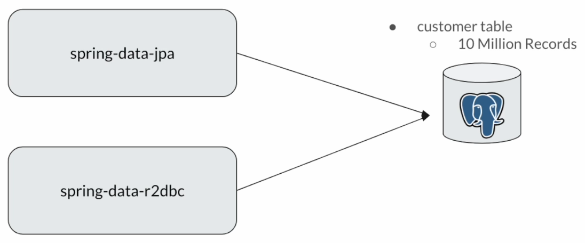

# SPRING WEBFLUX MASTERCLASS: REACTIVE MICROSERVICES

Del curso de UDEMY: `https://www.udemy.com/course/spring-webflux/`

## Introducción

Esto es lo que veremos en el curso:

Ya tenemos que saber programación reactiva, que incluye:

Para esto, ver mi repositorio: `https://github.com/JoseManuelMunozManzano/Mastering-Java-Reactive-Programming/tree/main`.

En esta sección (y para las siguientes) nuestro objetivo es configurar un proyecto de prácticas para aprender `Spring WebFlux`.

Aprenderemos varias características de `WebFlux`, `R2DBC` (Reactive Data Access) y escribiremos tests de integración.

Al final, configuraremos otro proyecto para desarrollar un sistema reactivo.

## Traditional vs Reactive APIs

[README.md](./01-webflux-playground/README.md#traditional-vs-reactive-apis)

Para ver como se diferencia la programación de una API tradicional de una reactiva, ver proyecto `01-webflux-playground`, paquete `sec01` donde están las siguientes clases:

- `Product`
  - Es un record.
- `TraditionalWebController`
  - Es un controller hecho en programación tradicional.
- `ReactiveWebController`
  - Es un controller hecho en programación reactiva.

## Spring Data R2DBC

`R2DBC` significa `Reactive Relational Database Connectivity`.

Documentación:

- `https://r2dbc.io/spec/1.0.0.RELEASE/spec/html/`.
- `https://r2dbc.io/drivers/`.
- `https://r2dbc.io/spec/1.0.0.RELEASE/spec/html/#datatypes`.
- `https://docs.spring.io/spring-data/relational/reference/r2dbc.html`.
- `https://docs.spring.io/spring-data/relational/reference/r2dbc/query-methods.html`.
- `https://medium.com/@padiahrohit/enable-h2-console-in-java-reactive-environmant-dcfcfdd6858a`.

[README.md](./01-webflux-playground/README.md#spring-data-r2dbc)

Ver proyecto `01-webflux-playground`, paquete `sec02` para el proyecto con R2DBC.

- `WebfluxPlaygroundApplication.java`
    - El main, donde indicaremos que paquete tiene que escanear Spring para crear sus beans.
- `application.properties`
    - Indicamos la configuración de la BD para R2DBC.
- En `src/java/com/jmunoz/playground/sec02` creamos las clases:
  - `Customer`
    - Es la clase entity que representa a la tabla `customer`.
    - En el package entity.
  - `Product`
    - Es la clase entity que representa a la tabla `product`.
    - En el package entity.
  - `CustomerOrder`
    - Es la clase entity que representa a la tabla `customer_order`.
    - En el package entity.
  - `CustomerRepository`
    - Es la interfaz repository que usaremos para tener ya creado un CRUD.
    - Extiende de `ReactiveCrudRepository`.
    - En el package repository.
  - `ProductRepository`
    - Es la interfaz repository que usaremos para tener ya creado un CRUD.
    - Extiende de `ReactiveCrudRepository`.
    - En el package repository.
  - `CustomerOrderRepository`
    - Es la interfaz repository que usaremos para tener ya creado un CRUD.
    - Extiende de `ReactiveCrudRepository`.
    - En el package repository.
  - `OrderDetails`
    - Record con la representación de la fila que queremos obtener en la query.
    - En el package dto. 
- En `src/test/java/com/jmunoz/playground.tests.sec02` creamos la clase:
  - `AbstractTest`
    - Es una clase abstracta que extenderemos para hacer tests.
  - `Lec01CustomerRepositoryTest`
    - Es un test sobre la interface CustomerRepository.
  - `Lec02ProductRepositoryTest`
    - Es un test sobre la interface ProductRepository.
  - `Lec03CustomerOrderRepositoryTest`
    - Es un test sobre la interface CustomerOrderRepository.
  - `Lec04DatabaseClientTest`
    - Es un test para probar SQLs complejos usando DatabaseClient.

## R2DBC vs JPA/JDBC

Ver el proyecto `04-r2dbc-vs-jdbc` que da el profesor. Todo el proyecto ya viene codificado y solo tenemos que mirar las clases.

[README.md](./04-r2dbc-vs-jdbc/reactive-vs-traditional-postgres/README.md)

Es otra comparación entre reactivo y tradicional.

En concreto, se van a comparar las siguientes características del módulo Spring Data R2DBC contra el módulo Spring Data JPA:

- Eficiencia de recursos
  - Cuantos recursos de sistema usan.
- Rendimiento
  - Número de tareas ejecutadas por unidad de tiempo.

**Notas**

- No traeremos otras aplicaciones / capas web en el test, porque el resultado no sería preciso.
- No usaremos queries de larga ejecución.
  - Queremos testear r2dbc vs jdbc/jpa.
  - No el motor de BD.
  - Esas queries de larga ejecución serían buenas para comparar postgres contra mysql, cosa que no queremos.

**Configuración**

Esta es la configuración del proyecto:

- Ejecutar `docker-compose up`.
- Monitorizar la consola. Asegurar que tenemos 10 millones de customers insertados.
  - Esperar al mensaje `database system is ready to accept connections`.
