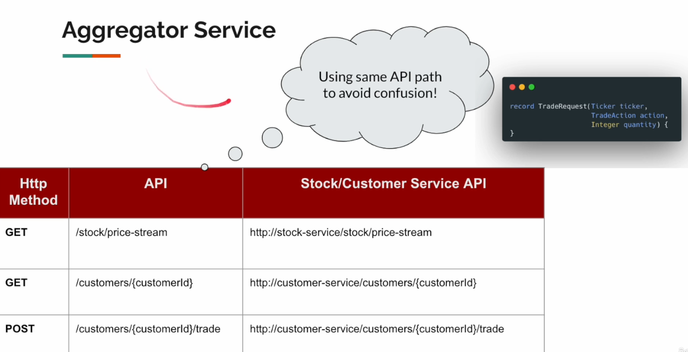
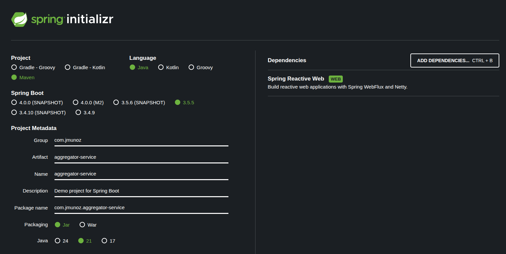
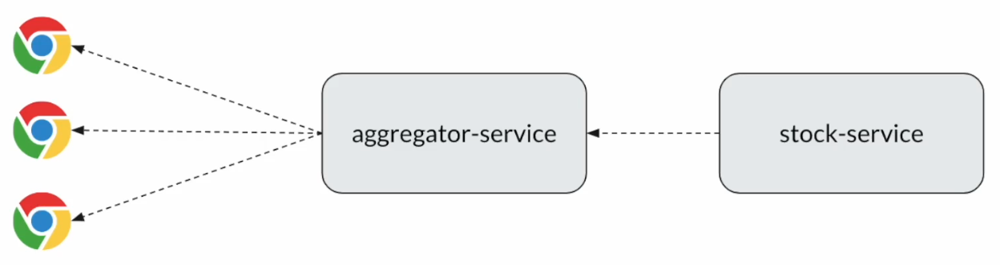
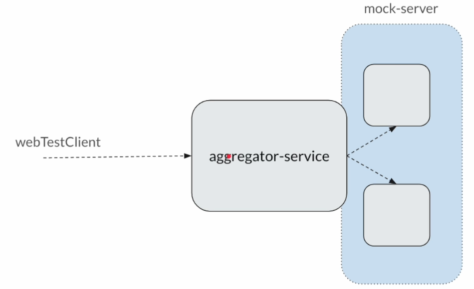
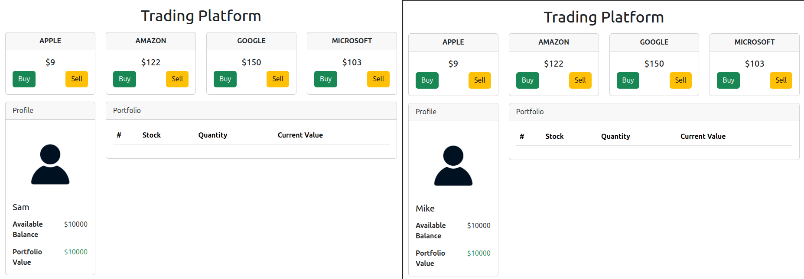

# AGGREGATOR SERVICE

## Introduction

La misión de `AggregatorService` es de orquestación. Depende de `Stock-Service` y `Customer-Service`.

Hablemos de los detalles de la API:



- Endpoint GET `/stock/price-stream`.
    - Obtendremos un stream de precios de acciones.
- Endpoint GET `/customers/{customerId}`
    - Lo llamaremos cuando el customer quiera obtener su portfolio.
- Endpoint POST `/customers/{customerId}/trade`
    - Lo llamaremos cuando el customer quiera comprar/vender acciones.
    - Tendremos que llamar al primer endpoint de `Stock-Service` para obtener el precio de esa acción.
    - Construiremos un objeto de tipo `StockTradeRequest` y haremos el POST a `Customer-Service`.

**Exceptions**

Las posibles excepciones son estas:

- Customer Not Found
    - Cuando `Customer-Service` devuelve 404
- Invalid Trade Request
    - Cuando fallan las validaciones de la petición de entrada
        - Estas son validaciones sencillas (no de dominio) que tendrá `Aggregator-Service`.
    - Cuando `Customer-Service` devuelve 400
        - Customer does NOT have enough balance
        - Customer does NOT have enough shares
- Devolveremos el error como Problem Detail

NOTA: `Stock-Service` no devuelve errores 4xx, por lo que no tenemos que preocuparnos de esto.

## Project Setup

Esta es la configuración realizada para crear este proyecto.



El nombre del paquete principal la paso de `aggregator_service` a `aggregator`, para evitar los guiones bajos.

En el pom se ha añadido la dependencia de `logback`.

Paquetes creados:

- `advice`
- `client`
- `config`
- `controller`
- `domain`
    - `Ticker`: Es un enum.
    - `TradeAction`: Es un enum.
- `dto`
    - `Holding`: Es un record.
    - `CustomerInformation`: Es el record con la respuesta de la petición GET.
    - `StockTradeRequest`: Es un record con el body de la petición POST.
    - `StockTradeResponse`: Es un record con la respuesta de la petición POST.
    - `TradeRequest`: Este record es genuinamente nuevo para este proyecto (no copiado del proyecto `customer-service`)
    - `PriceUpdate`: Este record es genuinamente nuevo para este proyecto (no copiado del proyecto `customer-service`)
      - Es el DTO para recoger la información del servicio externo `Stock Service`, del endpoint `/stock/price-stream`.
    - `StockPriceResponse`: Este record es genuinamente nuevo para este proyecto (no copiado del proyecto `customer-service`)
      - Es el DTO que se devuelve al customer, con información que proviene de `PriceUpdate`.
- `exceptions`
    - `CustomerNotFoundException`
    - `ApplicationExceptions`: El fuente que gestiona el tipo de excepción. Usando genéricos y programación reactiva.
- `service`
- `validator`

- Se han copiado las clases indicadas desde el proyecto `customer-service` para ahorrar tiempo y mantenerlo simple.
  - En la vida real podemos considerar crear un módulo Maven separado para así poder reutilizarlo.
  - Para buenas prácticas a la hora de compartir DTOs, ver: `https://www.vinsguru.com/microservices-architecture-how-to-share-dto-data-transfer-objects/`.

## Request Validator

En esta clase nos centramos en los packages siguientes:

- `exceptions`
  - `InvalidTradeRequestException`
  - `ApplicationExceptions`: Gestiona el tipo de excepción. También lanza las excepciones de las validaciones sencillas del request.
- `validator`
  - `RequestValidator`: Métodos helper con las validaciones que deben cumplirse.

## Stock Service Client

En esta clase nos centramos en los packages siguientes:

- `client`
    - `StockServiceClient`

## Hot Price Stream

En programación reactiva tenemos algo llamado `Hot Publisher`, que significa que solo habrá un publisher y tendremos varios subscribers.



Podemos imaginar que `Stock-service` es como un `Hot Publisher`. ¿Qué significa?

Imaginemos los `customer Portfolio` de los distintos customers. Cada uno será distinto al otro. Es información específica del customer.

Sin embargo, `Price Stream`, cuando emite el cambio de precios, este precio va a ser el mismo para todos.

Por tanto, no tenemos que llamar a `Stock-service` para obtener `Price stream` para cada uno de los customers, sino que obtenemos `Price stream` una vez y transmitimos (broadcast) ese mensaje a todos los customers.

En esta clase nos centramos en los packages siguientes:

- `client`
    - `StockServiceClient`

## Customer Service Client

En esta clase nos centramos en los packages siguientes:

- `client`
    - `CustomerServiceClient`

## Customer Portfolio Service

En esta clase nos centramos en los packages siguientes:

- `service`
    - `CustomerPortfolioService`: Responsable de obtener el portfolio del customer, llamando al cliente `customer-service`. También orquesta todo lo necesario para hacer un trade.

## Exposing Trade Platform APIs

En esta clase nos centramos en los packages siguientes:

- `controller`
    - `CustomerPortfolioController`
    - `StockPriceStreamController`

## @ControllerAdvice

En esta clase nos centramos en los packages siguientes:

- `advice`
    - `ApplicationExceptionHandler`: El controller advice. Dada una excepción, devuelve un objeto de tipo `ProblemDetail`.

## Configuration

En esta clase nos centramos en los packages siguientes:

- `config`
  - `ServiceClientsConfig`: Expone los beans de `client`.

- `application.properties`: Creamos las dos properties utilizadas en la clase de configuración, para indicar las urls de los servicios.

Ejecutamos la aplicación, para ver si hay algún error al arrancar. Luego la paramos.

## MockServer - Introduction

En las siguientes clases, nos vamos a centrar en escribir tests de integración para nuestro `aggregator-service`.

No son tests fáciles de hacer, porque depende de dos servicios externos, y no queremos que se estén ejecutando. Es decir, tenemos que testear `aggregator-service` de forma independiente.

Para hacer esto, vamos a ejecutar un `MockServer`.



Este `MockServer` puede simular `customer-service` y `stock-service` para que así podamos crear nuestros tests de integración.

Entonces, usando `webTestClient`, enviaremos la request y, basado en lo que tengamos `mockeado` veremos si obtenemos la response.

Documentación: 

- `https://www.mock-server.com/`
- `https://www.mock-server.com/mock_server/running_mock_server.html`
  - Lo suyo sería usar `Doker container`, pero vamos a usar `Spring Test Execution Listener`.
- `https://www.mock-server.com/mock_server/running_mock_server.html#spring_test_exec_listener`
  - Tenemos que añadir a nuestro pom la dependencia indicada en esta documentación, añadiendo `<scope>test</scope>`.
  - En la clase de test tenemos que indicar la anotación `@MockServerTest` para que se inyecte automáticamente una instancia de `MockServerClient`.
- `https://www.mock-server.com/mock_server/creating_expectations.html`
  - En esta documentación vemos como personalizar el mock para nuestros tests en `Request Properties Matcher Code Examples` y luego `match request by path`, `match request by regex path` y `match request by path parameter and query parameter`.
  - Se pueden simular muchas maś cosas, como cookies, etc.
  - Ver también la parte `Response Action Code Examples` y luego `literal response with 10 second delay` para simular un servidor remoto lento.
  - Ver también la parte `Error Action Code Examples` y luego `drop connection error` para simular que la conexión se cae.

## Integration Test - Setup

Añadimos al pom la dependencia de `MockServer` (ver documentación por si ha cambiado):

```xml
<dependency>
    <groupId>org.mock-server</groupId>
    <artifactId>mockserver-spring-test-listener-no-dependencies</artifactId>
    <version>5.14.0</version>
    <scope>test</scope>
</dependency>
```

En `/src/test/java/com.jmunoz.aggregator` se crea la siguiente clase abstracta:

- `AbstractIntegrationTest`: Clase abstracta que será extendida por otras con la siguiente configuración:

```java
// El puerto cambia (es dinámico) y por eso indicamos ${mockServerPort}
@MockServerTest
@AutoConfigureWebTestClient
@SpringBootTest(properties = {
        "customer.service.url=http://localhost:${mockServerPort}",
        "stock.service.url=http://localhost:${mockServerPort}"
})
abstract class AbstractIntegrationTest {

    // Gracias a la anotación @MockServerTest, automáticamente se inyecta MockServerClient (no hace falta @Autowired)
    protected MockServerClient mockServerClient;

    @Autowired
    protected WebTestClient client;
}
```

La clase que aparecía por defecto, `AggregatorServiceApplicationTests` se borra.

## Mocking Customer Service

Podríamos usar una única clase para escribir los tests de integración, pero para evitar confusiones se va a hacer una clase por API.

En `/src/test/java/com.jmunoz.aggregator` se crea la siguiente clase de test:

- `CustomerInformationTest`

En `/src/test/resources/customer-service` se crea el siguiente fichero:

- `customer-information-200.json`: El 200 indica el status code que voy a esperar para estos responseBody.

Estos ficheros contienen los responseBody de las peticiones, y se indican en un fichero aparte para que no afecte a la legibilidad de los tests.

Para leer este fichero, modificamos `AbstractIntegrationTest.java`.

Ejecutar el test. No hace falta ejecutar ningún otro proyecto, solo ejecutar los tests uno a uno y luego todos juntos.

## Integration Tests - Customer Information API Test

En `/src/test/java/com.jmunoz.aggregator` mejoramos el test:

- `CustomerInformationTest`

En `/src/test/resources/customer-service` se crea el siguiente fichero:

- `customer-information-404.json`: El 404 deja claro que es un responseBody con response status code 404.

## Integration Tests - Stock Service Stream API Test

En `/src/test/java/com.jmunoz.aggregator` se crea la siguiente clase de test:

- `StockPriceStreamTest`

En `/src/test/resources/stock-service` se crea el siguiente fichero:

- `stock-price-stream-200.jsonl`: JSONL significa JSON lines, aunque la extensión da igual porque en `AbstractIntegrationTest` se lee como un string.

Ejecutar el test. No hace falta ejecutar ningún otro proyecto, solo ejecutar los tests uno a uno y luego todos juntos.

## Integration Tests - Customer Trade API Test

En `/src/test/java/com.jmunoz.aggregator` se crea la siguiente clase de test:

- `CustomerTradeTest`: En este test de integración se llama tanto a `stock-service` como a `customer-service`.

En `/src/test/resources/stock-service` se crea el siguiente fichero:

- `stock-price-200.json`

En `/src/test/resources/customer-service` se crea el siguiente fichero:

- `customer-trade-200.json`
- `customer-trade-400.json`

Ejecutar el test. No hace falta ejecutar ningún otro proyecto, solo ejecutar los tests uno a uno y luego todos juntos.

## Demo via Postman

En este punto todo parece correcto, así que podemos ejecutar todas nuestras aplicaciones para ver como trabajan.

Vamos a hacer tests a las APIs de `aggregator-service` usando Postman.

- Ejecutamos el servicio externo `external-services.jar`: `java -jar external-services.jar`
- Ejecutamos nuestro proyecto `customer-service` usando IntelliJ Idea.
- Ejecutamos nuestro proyecto `aggregator-service` usando IntelliJ Idea.

Abrimos Postman. En la carpeta `postman` de este proyecto se encuentra un fichero que podemos importar para trabajar con el.

¿Cómo podemos validar el stream de precios? Podemos usar en una terminal: `curl http://localhost:8080/stock/price-stream`.

## Trading Platform - Final Demo

Tenemos un fichero HTML con una UI con la que podremos jugar un poco situado en `src/main/resources/static`.

- `index.html`

- Ejecutamos el servicio externo `external-services.jar`: `java -jar external-services.jar`
- Ejecutamos nuestro proyecto `customer-service` usando IntelliJ Idea.
- Ejecutamos nuestro proyecto `aggregator-service` usando IntelliJ Idea.
- Abrimos un navegador y vamos a la ruta `http://localhost:8080?customer=1`
- Abrimos otro navegador y vamos a la ruta `http://localhost:8080?customer=2`

Veremos estas pantallas:



Donde en ambas se puede ver el mismo precio de acciones. 

Podemos quedarnos solo con un navegador e ir jugando. Pulsando los botones `Buy` y `Sell` podemos comprar/vender de acción en acción.

Ahora probemos a matar el proceso `external-services`. Veremos en los logs de `aggregator-service` que intenta reconectar y los precios del navegador dejan de actualizarse.

Si volvemos a levantar el servicio `external-services` veremos en el navegador que los precios vuelven a actualizarse.