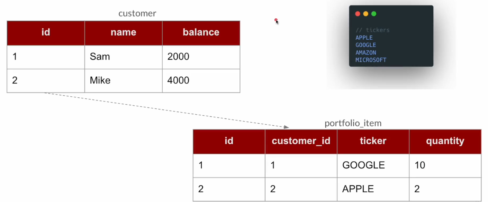
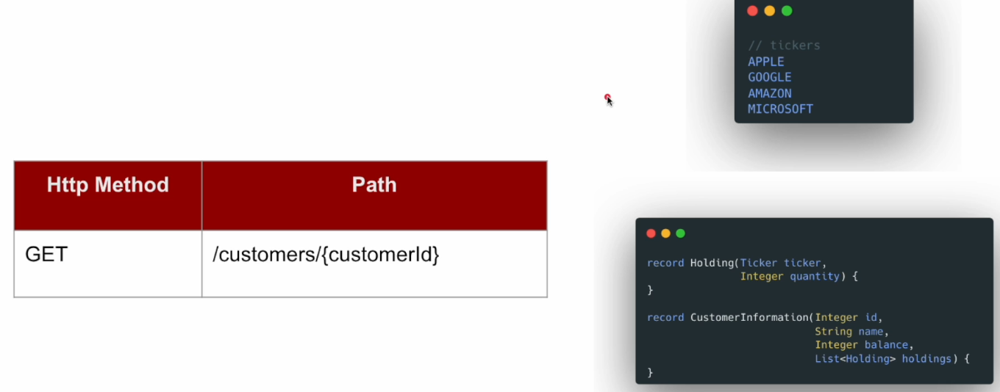
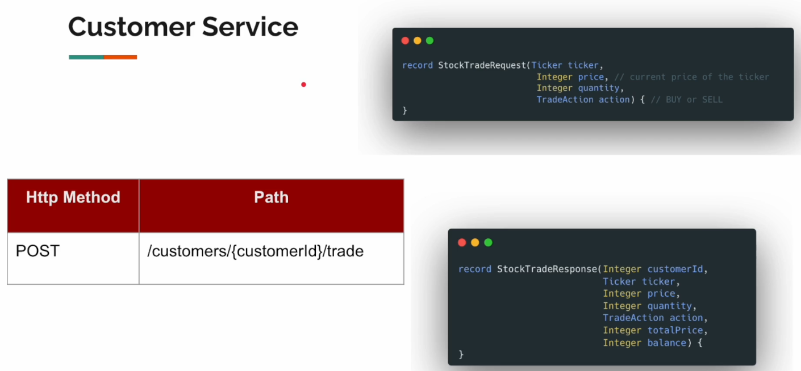
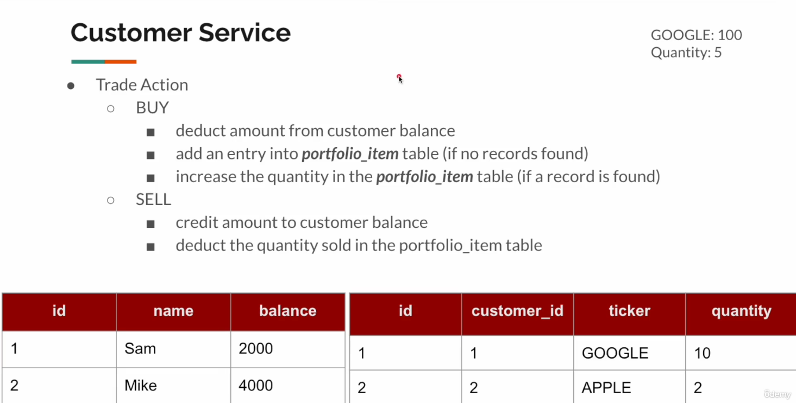
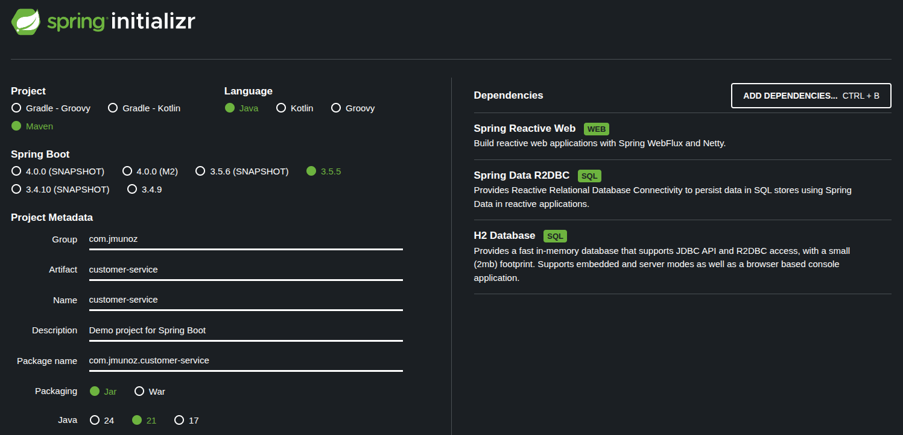

# CUSTOMER SERVICE

## Customer Portfolio - Requirements Discussion

En esta clase vamos a ver detalles de bajo nivel para `Customer-Service`.



- No vamos a preocuparnos por el típico CRUD como crear customer, delete customer, etc. Ya hemos hecho muchos en el curso.
- Nuestro foco va a consistir en gestionar el portfolio del customer.
- Viendo la imagen el significado es el siguiente:
    - Sam posee 10 acciones de GOOGLE.
    - Mike posee 2 acciones de APPLE.

El SQL que vamos a usar para este servicio es este (está situado en `src/main/resources/sql/data.sql`):

```roomsql
DROP TABLE IF EXISTS customer;
DROP TABLE IF EXISTS portfolio_item;

CREATE TABLE customer (
    id int AUTO_INCREMENT primary key,
    name VARCHAR(50),
    balance int
);

CREATE TABLE portfolio_item (
    id int AUTO_INCREMENT primary key,
    customer_id int,
    ticker VARCHAR(10),
    quantity int,
    foreign key (customer_id) references customer(id)
);

insert into customer(name, balance)
    values
        ('Sam', 10000),
        ('Mike', 10000),
        ('John', 10000);
```

Hablemos de los detalles de la API:



- Endpoint GET con un path variable `customerId`.
    - Devolveremos la información del record `CustomerInformation`.



- Endpoint POST con un path variable `customerId`.
    - Recibiremos como body un objeto de tipo `StockTradeRequest`.
    - Devolveremos como respuesta un objeto de tipo `StockTradeResponse` si todo va bien.
        - `balance` indica la cantidad de saldo que queda una vez se ha realizado la orden.

Esto sería un ejemplo de ejecución:



**BUY**

- Si cada acción de GOOGLE vale `$100` y quiero comprar 5 acciones, el precio total será de `$500`.
- Confirmo que Sam (el que quiere comprar la acciones), posee ese saldo. Como tiene `$2000` lo cumple.
    - Su saldo queda en `$1500`.
- Vamos a su portfolio y vemos que Sam ya posee acciones de GOOGLE.
    - Actualizamos la cantidad a 15 acciones.
- Si Sam no tuviera registros entonces se añade un nuevo registro con la cantidad de 5 acciones.

**SELL**

- Si cada acción de GOOGLE vale `$100` y quiero vender 5 acciones, el precio total será de `$500`.
- Confirmo que Sam (el que quiere vender la acciones), posee esa cantidad de acciones en su portfolio.
    - Como tiene 10, sus acciones se actualizan a 5.
    - Si tuviera 5 acciones, sus acciones se quedan a 0 (no se elimina el registro)
- Su saldo se incrementa, pasando a tener `$2500`.

**Exceptions**

Las posibles excepciones son estas:

- Customer Not Found
- Customer does NOT have enough balance
- Customer does NOT have enough shares
- Devolveremos el error como Problem Detail
    - 4xx error, donde xx será el número concreto del error.

## Project Setup

Esta es la configuración realizada para crear este proyecto.



El nombre del paquete principal la paso de `custom_service` a `customerportfolio`, para evitar los guiones bajos.

En el pom se ha añadido la dependencia de `logback`.

Paquetes creados:

- `advice`
- `controller`
- `domain`
- `dto`
- `entity`
- `exceptions`
- `mapper`
- `repository`
- `service`

En `src/main/resources` se ha creado/modificado:

- `application.properties`
  - Hemos añadido propiedades para indicar el puerto y donde están situadas las inicializaciones de data.
- `logback.xml`
- `sql`
  - `data.sql`: Creación de tablas e inicializaciones de data.

## DTO / Entity / Repository

En esta clase nos centramos en los packages siguientes:

- `domain`
  - `Ticker`: Es un enum.
  - `TradeAction`: Es un enum.
- `dto`
  - `Holding`: Es un record.
  - `CustomerInformation`: Es el record con la respuesta de la petición GET.
  - `StockTradeRequest`: Es un record con el body de la petición POST.
  - `StockTradeResponse`: Es un record con la respuesta de la petición POST.
- `entity`
  - `Customer`
  - `PortfolioItem`
- `repository`
  - `CustomerRepository`: Es una interface.
  - `PortfolioItemRepository`: Es una interface.

## Application Exceptions

En esta clase nos centramos en los packages siguientes:

- `exceptions`
  - `CustomerNotFoundException`
  - `InsufficientBalanceException`
  - `InsufficientSharesException`
  - `ApplicationExceptions`: El fuente que gestiona el tipo de excepción. Usando genéricos y programación reactiva.

## Customer Information Service

En esta clase nos centramos en los packages siguientes:

- `services`
  - `CustomerService`: En este servicio obtenemos la información del cliente.
- `mapper`
  - `EntityDtoMapper`

## Trade Buy Request Handler

En esta clase nos centramos en los packages siguientes:

- `services`
    - `TradeService`: En este servicio haremos la compra y venta de acciones.
      - Hacemos la parte de la compra.

## Trade Sell Request Handler

En esta clase nos centramos en los packages siguientes:

- `services`
    - `TradeService`: En este servicio haremos la compra y venta de acciones.
      - Hacemos la parte de la venta.

## Controller

En esta clase nos centramos en los packages siguientes:

- `controller`
    - `CustomerController`: Exponemos nuestras APIs.

## Exception Handler

En esta clase nos centramos en los packages siguientes:

- `advice`
    - `ApplicationExceptionHandler`: El controller advice. Dada una excepción, devuelve un objeto de tipo `ProblemDetail`.

## Integration Tests

Vamos a ejecutar la aplicación para ver si no da errores de ejecución. 

Paramos la ejecución y nos enfocamos en los tests de integración.

En esta clase nos centramos en los packages siguientes (dentro de `test`):

- `CustomerServiceApplicationTests`: Añadimos logger, la anotación `@AutoConfigureWebTestClient` y tests.

Ejecutamos los tests uno a uno.